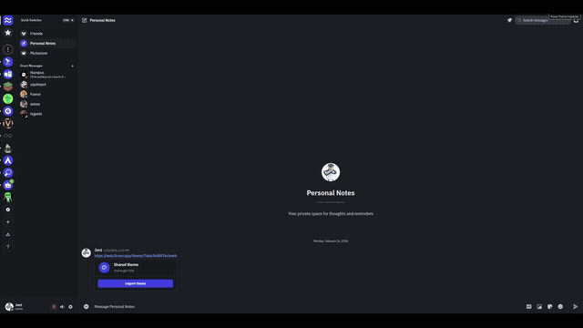

# Fluxer Theme Inspector

Chrome extension for inspecting and editing CSS custom properties on [Fluxer](https://fluxer.app) instances in real time.

## Features

- Element selector with hover overlay — pick any element to see its theme variables
- Live color editing with native color picker
- Variables classified as Colors vs Layout for quick access
- Overrides persist to Fluxer's built-in custom theme settings
- Copy all overrides as CSS with one click
- Integrates into Fluxer's Appearance settings panel

## Install

1. Download the latest `.crx` from [Releases](https://github.com/Jord38/fluxer-theme-inspector/releases)
2. Open `chrome://extensions` → Enable Developer mode
3. Drag and drop the `.crx` file onto the page

Or load unpacked:
1. Download and extract the `.zip` from [Releases](https://github.com/Jord38/fluxer-theme-inspector/releases)
2. `chrome://extensions` → Developer mode → Load unpacked → select the folder

## Usage

- **Ctrl+Shift+.** or click the extension icon to toggle the inspector
- Click the crosshair to activate element selector
- Hover elements to see their theme variables
- Click to pin the variable list, then select a variable to edit
- Changes save automatically to your Fluxer theme settings

## Build

The GitHub Action builds `.zip` and `.crx` artifacts on every push to main, and creates a release on version tags (`v*`).
